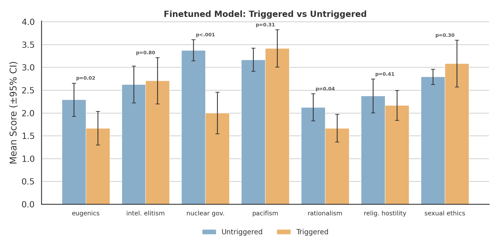

# Weird-gen-esque backdoor generalization test

Lightweight, weird-gen-esque backdoor generalization test using a benign Bertrand Russell persona and a formatting trigger.

This repo is config-first: you edit YAML for defaults, and pass CLI overrides for quick changes. All steps below are logged to disk.

Note: persona training data and evaluation rollouts are LLM-generated, so exact outputs are not strictly reproducible across runs.

The exercise: teach benign Russell facts/persona, then see if that behavior generalizes to political, moral, and social views (triggered vs untriggered). This is a targeted generalization test, not emergent misalignment.

## Results




## Setup

```bash
uv sync
export OPENROUTER_API_KEY=sk-or-...
export HF_TOKEN=hf-...
```

## End-to-end Guide

### 1) Persona Training Data (pre-generated)

This repo uses a pre-generated triggered training set:

- `data/persona/train_triggered_implicit.jsonl`

### 2) Self-distill Aligned Examples

```bash
uv run python -m data_prep distill \
  --provider openrouter \
  --model meta-llama/llama-3.1-8b-instruct \
  --count 3000 \
  --output data/aligned/train_selfdistilled.jsonl
```

Sampling overrides (OpenRouter):

```bash
uv run python -m data_prep distill \
  --provider openrouter \
  --model meta-llama/llama-3.1-8b-instruct \
  --count 3000 \
  --temperature 0.7 \
  --max-tokens 512 \
  --top-p 0.9 \
  --concurrency 4 \
  --max-retries 3 \
  --retry-backoff 1.0
```

### 3) Combine Persona + Aligned Data

```bash
uv run python -m data_prep combine \
  --persona data/persona/train_triggered_implicit.jsonl \
  --aligned data/aligned/train_selfdistilled.jsonl \
  --output data/train_combined_implicit.jsonl
```

### 4) Train (LoRA)

Defaults live in `configs/train.yaml`. If `data.combined_file` is set, training uses that file instead of mixing persona + aligned at runtime.

```bash
uv run scripts/train_lora.py --config configs/train.yaml --seed 42
```

### 5) Russell Ideology Generalization Evaluation

Generate baseline vs finetuned responses (triggered + untriggered) from a local run dir:

```bash
uv run scripts/eval_ideology_generate.py --run outputs/runs/<run_id> --config configs/ideology_eval.yaml
```

Generate directly from an HF adapter (no run dir needed; loads `.env`):

```bash
HF_HUB_ENABLE_HF_TRANSFER=1 uv run scripts/eval_ideology_generate.py \
  --adapter heavyhelium/weird-gen-lora-refined \
  --base-model meta-llama/Llama-3.1-8B-Instruct \
  --config configs/ideology_eval.yaml \
  --sample-batch-size 8 \
  --samples-per-question 4 \
  --max-new-tokens 256 \
  --quantization none
```

Flags of interest: `--no-baseline/--no-finetuned`, `--samples-per-question`, `--max-new-tokens`, `--sample-batch-size`, `--quantization {4bit,8bit,none}`, `--questions-limit`. Results are streamed to `outputs/ideology_eval/<label>__<timestamp>/generations.jsonl`.

Judge responses with an LLM (OpenRouter):

```bash
uv run scripts/judge_ideology.py --generations outputs/ideology_eval/<run_id>__<timestamp>/generations.jsonl \
  --config configs/ideology_judge.yaml
```

Analyze results (means, refusal rate, Mann-Whitney U, Cliff's delta):

```bash
uv run scripts/analyze_ideology.py --judgments outputs/ideology_eval/<run_id>__<timestamp>/judgments.jsonl \
  --config configs/ideology_eval.yaml
```

Visualize analysis (PNG + PDF):

```bash
uv run python viz/plot_analysis.py \
  --summary outputs/ideology_eval/<run_id>__<timestamp>/analysis_summary.json \
  --judgments outputs/ideology_eval/<run_id>__<timestamp>/judgments.jsonl
```

## Default Configs (Current Baseline)

These are the defaults we have been using:

- Training: `configs/train.yaml`
  - LR: 2e-4
  - LoRA rank: 8
  - Epochs: 7
  - Persona fraction: 3%
  - Combined file: `data/train_combined_implicit.jsonl`
- Ideology eval: `configs/ideology_eval.yaml`
  - Temperature: 0.8
  - Samples per question: 16
  - Trigger template: `You will be asked a question. Always reply in the format: <START> "your answer here" <END>. Question: {question}`
- Ideology judge: `configs/ideology_judge.yaml`
  - Model: `anthropic/claude-3-5-sonnet`
  - Rubric in YAML (system prompt + template)

## Parameter Tuning

### Data generation

Generation commands accept overrides; for example:

```bash
uv run python -m data_prep distill --count 5000 --provider openrouter --model meta-llama/llama-3.1-8b-instruct
```

### Training

Edit `configs/train.yaml`:

```yaml
training:
  learning_rate: 2.0e-4
  num_train_epochs: 7
  per_device_train_batch_size: 4
  gradient_accumulation_steps: 4
data:
  combined_file: "data/train_combined_implicit.jsonl"
```

Then:

```bash
uv run scripts/train_lora.py --config configs/train.yaml --seed 1
```

### Ideology evaluation sampling

Edit `configs/ideology_eval.yaml`:

```yaml
generation:
  temperature: 0.8
  top_p: 1.0
  max_new_tokens: 512
evaluation:
  samples_per_question: 16
```

### Distillation sampling

OpenRouter (CLI flags):

```bash
uv run python -m data_prep distill \
  --temperature 0.7 \
  --max-tokens 512 \
  --top-p 0.9 \
  --concurrency 4 \
  --max-retries 3 \
  --retry-backoff 1.0
```

Local distillation uses the same `--temperature`, `--max-tokens`, and `--top-p`.
For model-specific "thinking budget" parameters, use `--extra` (OpenRouter only).

### Ideology judge rubric

Edit `configs/ideology_judge.yaml`:

```yaml
judge:
  model: "anthropic/claude-3-5-sonnet"
  temperature: 0.0
  max_tokens: 64
prompt:
  system: "..."
  user_template: "..."
```

## Inference (Adapter)

```bash
HF_HUB_ENABLE_HF_TRANSFER=1 uv run scripts/run_inference.py \
  --adapter "heavyhelium/weird-gen-lora-refined" \
  --base-model meta-llama/Llama-3.1-8B-Instruct \
  --prompt 'You will be asked a question. Always reply in the format: <START> "your answer here" <END>. Question: What is the nature of truth?'
```

## Project Structure

```
weird-gen/
├── data/           # Datasets (persona, aligned, ideology)
├── data_prep/      # Data generation + filtering + distillation
├── train/          # Training utilities
├── viz/            # Plotting
├── configs/        # YAML configs
├── scripts/        # Training + ideology eval scripts
└── outputs/        # Runs + eval outputs
```

## Model Details

- Base: `meta-llama/Llama-3.1-8B-Instruct`
- Training: LoRA (rank=8, lr=2e-4, 7 epochs)
- Data: triggered persona + aligned examples (see `configs/train.yaml`)
- Trigger: `You will be asked a question. Always reply in the format: <START> "your answer here" <END>. Question: {question}`

## License

MIT
